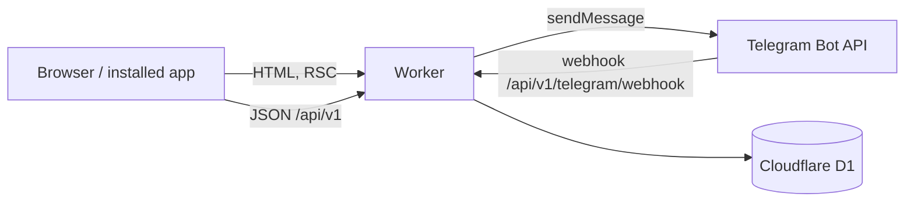

# Architecture

BugunBor is one Cloudflare Worker (vinext = Next.js App Router on Vite) with one D1 database. Pages render on the server; small client components handle interaction (claiming, forms, QR scanning, uploads).

## Layers

| Layer | Where | Rule |
| --- | --- | --- |
| Pages and route handlers | `app/` | Parse input, check the session and role, call a module, render or return JSON |
| Domain modules | `modules/*` | All business rules and SQL. Framework-free, so they are unit-tested against a real SQLite |
| Shared libraries | `lib/` | i18n, Tashkent time, money/number formatting, search normalisation, cities |
| Data | `db/` | Migrations (applied once per isolate), D1 client, demo seed |

Modules never import from `app/`. Only `db/client.ts` and `modules/jobs.ts` touch the Workers runtime (`cloudflare:workers`), which keeps everything else testable with `node:sqlite` (`test/d1.ts`).

## Key decisions

- **Atomic claims.** A claim is one D1 batch (a transaction): a conditional `INSERT … SELECT` re-checks every rule (live window, stock, per-customer limit, branch, business on air) and the stock decrement only runs if that insert happened. The last unit can never be sold twice. Idempotency keys make retries safe.
- **Codes.** Six characters from an unambiguous alphabet, derived with HMAC from the redemption id and `HASH_SECRET`; only a hash is stored. The QR encodes `APP_URL/r/CODE`, which opens the staff check page.
- **Terminal events.** Completing, cancelling or expiring a code writes one terminal event (unique index); side effects such as returning stock key on that event, so repeated requests cannot double-apply.
- **Derived deal status.** Stored statuses are DRAFT, PENDING_REVIEW, ACTIVE, PAUSED, REJECTED, ARCHIVED; “scheduled”, “live”, “sold out” and “ended” are derived from time and stock (`modules/deals/status.ts`).
- **Tenant isolation.** Every business action goes through `requireMembership(user, business, action)` with role grants (OWNER, MANAGER, CASHIER). Business ids in URLs are never trusted on their own.
- **Billing gate.** A business is “on air” while its free period or paid plan is running (`subscriptionActiveSql`). Listing and claiming both check it; plan limits cap branches, live deals, staff and top slots.
- **Notifications outbox.** Domain code inserts rows into `notifications` inside its own transaction, deduplicated by key. A background job (`modules/jobs.ts`, at most once a minute per isolate, via `waitUntil`) claims due rows atomically and sends them to Telegram, with retries and permanent-failure detection.
- **Media.** Browsers resize and re-encode photos to WebP before upload. The server checks magic bytes, pixel size and byte size, stores the image in D1 and serves `/media/:id` with a one-year immutable cache (plus the edge cache). Unused uploads are pruned after a day. Moving to R2 later only changes `modules/media/service.ts`.
- **Demo photos.** Curated, freely licensed Wikimedia Commons photos in `public/photos` (1200 px and 720 px WebP, served with `srcset`), keyed by deal visual; `plov-2`, `plov-3` are variants picked by deal slug, so a deal keeps its photo and the catalogue does not repeat one. Only demo deals use them; `/credits` lists authors and licences. `scripts/fetch-stock-photos.mjs` reproduces the set, `scripts/import-photos.mjs` adds photos from a folder with a credits CSV.
- **Lazy maintenance.** Expiring stale codes, cleaning login requests, sessions and rate-limit windows runs at most once a minute per isolate, triggered by traffic (`runMaintenance`).
- **Time.** Everything is stored as UTC `YYYY-MM-DD HH:MM:SS`; the UI shows Tashkent time (UTC+5, no DST).
- **Search.** Titles and descriptions are stored normalised (lower case, Cyrillic transliterated, apostrophes removed), so “osh”, “ош” and “O‘sh” match.
- **Demo mode.** Development (or `DEMO_SEED=true`) seeds fictional businesses for every city and category, version-gated so it runs once per catalogue change. Demo rows are `is_demo = 1` and hidden when demo mode is off.

## Authentication

Telegram device flow: the site creates a login request and opens the bot with a one-time token; the user confirms in Telegram (sharing their phone the first time); the site polls and receives a session. Sessions are random tokens stored hashed, 30 days, `HttpOnly; SameSite=Lax; Secure`. Development adds one-click demo logins, compiled out of production builds.

## Apps

The site is an installable PWA (`app/manifest.ts`, `public/sw.js`, icons in `public/icons`). The Android app is a Trusted Web Activity over the same origin; iOS follows the same approach. Pages and API responses are never cached by the service worker, so prices, stock and codes stay live.
