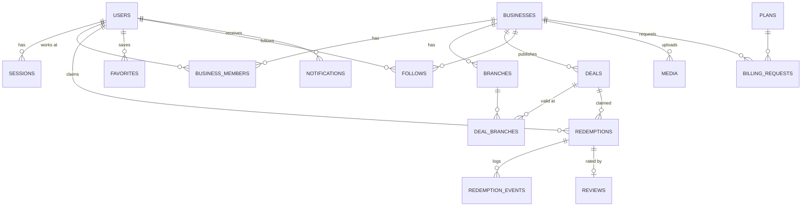

# Data model

Cloudflare D1 (SQLite). Migrations live in `db/migrations.ts`, are applied in order on the first request of each isolate and recorded in `_migrations`. Times are UTC text `YYYY-MM-DD HH:MM:SS`; money is integer so‘m; coordinates are integer micro-degrees (`latitude_e6`).

| Table | Purpose and notable rules |
| --- | --- |
| `users` | Platform role (CUSTOMER, MODERATOR, ADMIN), status, Telegram id, phone (unique when set), locale, notification switches |
| `sessions` | Hashed session tokens, 30-day expiry, revocation |
| `login_requests` | Telegram device-flow logins: hashed token, match code, status, short expiry |
| `businesses` | Profile, city, category, verification (PENDING, VERIFIED, REJECTED), suspension, free period (`trial_ends_at`), paid plan (`plan_code`, `paid_until`), rating aggregate, logo/cover media, `is_demo` |
| `business_members` | Staff with role OWNER, MANAGER or CASHIER; revocation instead of deletion |
| `branches` | Address, coordinates, working hours, optional phone |
| `categories` | Slug, Uzbek and Russian names, icon, order, active flag |
| `deals` | Prices, window, stock (`remaining_quantity`), per-customer limit, code lifetime, stored status, moderation fields, visual or photo, search text, views, `is_demo` |
| `deal_branches` | Where a deal can be redeemed |
| `redemptions` | One claim: status CLAIMED, COMPLETED, CANCELED or EXPIRED; hashed code; idempotency key; at most one active claim per customer and deal |
| `redemption_events` | Claim and terminal events; one terminal event per redemption (unique index) |
| `favorites` | Saved deals |
| `follows` | Customer follows a business |
| `reviews` | Rating 1–5 and optional comment for a completed redemption; one per redemption; VISIBLE or HIDDEN |
| `notifications` | Telegram outbox: kind, dedupe key (unique), status PENDING, SENDING, SENT, SKIPPED or FAILED, retries |
| `media` | Uploaded images (base64 WebP/JPEG/PNG) with size, dimensions and hash |
| `user_avatars` | One optional profile photo per person (base64, size, dimensions, hash); seen only by that person, never public; deleted with the account |
| `plans` | Start, Biznes, Premium: monthly price and limits (branches, live deals, staff, top slots) |
| `billing_requests` | Plan purchase requests confirmed by an admin |
| `app_settings` | Free-period length and plan, payment instructions, demo seed version |
| `contact_messages` | Contact form inbox |
| `moderation_actions`, `audit_logs` | Who decided what, with reasons and before/after snapshots |
| `rate_limits` | Fixed-window counters for login, claims, code checks, contact form, writes |
