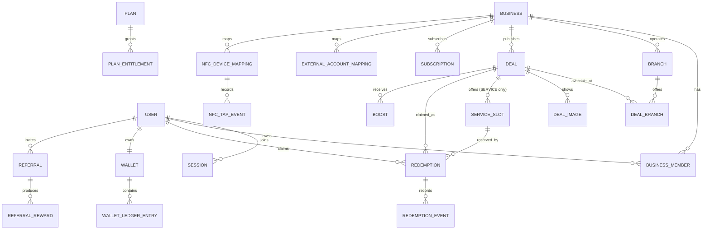

# Database model

## Core relationship map

## Normalized entity inventory

- Identity: `User`, `Account`, `Session`, `VerificationToken`.
- Tenancy: `Business`, `BusinessMember`, `Branch`, `WorkingHours`, `VerificationRequest`.
- Marketplace: `Category`, `Deal` (`deal_type`: PRODUCT | SERVICE), `DealBranch`, `DealImage`, `ServiceSlot`, `Favorite`, `Follow`.
- Fulfilment: `Redemption`, `RedemptionEvent`.
- Incentives: `Wallet`, `WalletLedgerEntry`, `BonusRule`, `Referral`, `ReferralReward`.
- Commercial: `Plan`, `PlanEntitlement`, `Subscription`, `Boost`.
- Integrations: `ExternalAccountMapping`, `NFCDeviceMapping`, `NFCTapEvent`, `IntegrationEvent`, `WebhookEvent`.
- Trust/operations: `Notification`, `Report`, `ModerationAction`, `FeatureFlag`, `AuditLog`.

## Critical constraints

- Normalized phone and non-null email values are unique.
- Business slug, category slug, deal `(business_id, slug)` and NFC public token hash are unique.
- Business membership is unique on `(business_id, user_id)`.
- One favorite exists per `(user_id, deal_id)` and one follow per `(user_id, business_id)`.
- A redemption is unique by idempotency key and by `(deal_id, user_id, claim_sequence)`; its code hash is unique.
- A `ServiceSlot.remaining_capacity` is always between 0 and `capacity`; a SERVICE deal's own `total_quantity`/`remaining_quantity` stay null — availability lives on its slots.
- A PRODUCT deal requires at least 2 and at most 6 `DealImage` rows (enforced by `POST /api/v1/deals`'s validation, not a DB constraint).
- Ledger idempotency key is globally unique. Amount is non-zero and stored in integer BB units.
- Webhook uniqueness is `(provider, external_event_id)`; raw secrets/tokens never persist.
- Soft deletion uses `deleted_at`; financial, audit and redemption event rows are retained/append-only.

## Transaction invariants

Redemption claim locks or conditionally updates the deal row (PRODUCT) or the claimed `ServiceSlot` row (SERVICE), checks state/time/customer limit, decrements remaining quantity or slot capacity, inserts redemption + event, and emits an outbox notification in one transaction. A deal edit past ACTIVE is rejected before any write by `modules/deals/policy.ts`, which is the single source of truth for what a business may still change once a deal is live. Wallet commands insert a ledger entry and derived balance snapshot atomically, reject negative results, and verify the ledger aggregate. Webhook processing inserts the unique event before side effects, making retries safe.
